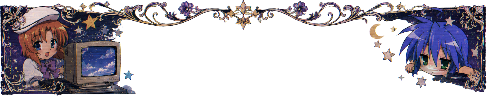
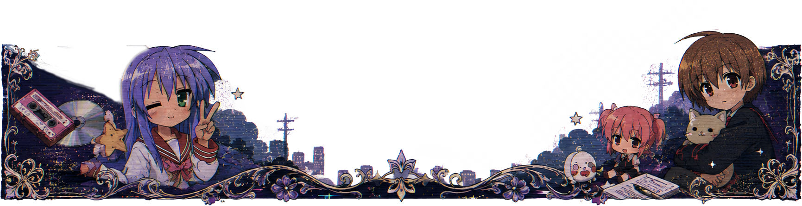

<!--
  Satoru's GitHub Profile README
  Banner recommendation: 2400x300 or 3200x360, very wide and narrow.
-->

<!-- 

  <picture>
    <source media="(prefers-color-scheme: dark)" srcset="../assets/banner-retro-anime-up.png">
    <source media="(prefers-color-scheme: light)" srcset="../assets/banner-retro-anime-up.png">
    
  </picture>

 -->

<h1 align="center">渡辺暁</h1>

  

  <em>ロボットは電子ヤギの夢を見るか？</em>

  
  
  
  

  🌐 <a href="../README.md">English</a> · <a href="./README.zh_cn.md">简体中文</a> · <a href="./README.zh_tw.md">繁體中文</a> · 日本語

  

## 私について

こんにちは！**渡辺暁**（わたなべ あきら / Satoru Watanabe）です。

中国の華中師範大学で電子情報科学技術を専攻する学部生です。

私は物を作り、その仕組みを理解し、実践を通して学ぶことに情熱を注いでいます。現在は主に AI、大規模言語モデル、ソフトウェアエンジニアリング、組み込みシステムの探索に時間を費やしています。

面白いアイデアを現実のプロジェクトにすることが好きです。小さな開発者ツールであれ、組み込み実験であれ、AI ワークフローであれ、それが*どのように*動作するかだけでなく、*なぜ*そのように設計されたのかを理解したいと思っています。

---

## 現在の取り組み

現在最も時間を費やしている分野は以下の通りです：

- 🤖 AI エージェントと大規模言語モデルアプリケーション
- 🛠 開発者ツールと自動化
- 💻 ソフトウェアエンジニアリングとオープンソースプロジェクト
- 🔌 組み込みシステムと電子技術
- 📚 機械学習と自動制御の基礎を固める

新しいアイデアを試したり、ソースコードを読んだり、日常の開発で実際の問題を解決する小さなプロジェクトを作ることが好きです。

## Tech Stack

  

  
  
  
  

---

## 現在探求していること

- 機械学習の基礎知識を学ぶ
- 自動制御理論を研究する
- AI 支援開発ワークフローを構築する
- マルチエージェントシステムを実験する
- 日常の仕事をより楽しくするツールを開発する
- 興味深いオープンソースプロジェクトのソースコードを読む

---

## 注目プロジェクト

| プロジェクト | 説明 |
| :--- | :--- |
| [Telegodex](https://github.com/AonoChano/telegodex) | Telegram からリモートで Codex、Claude Code などのコーディングエージェントを実行および監督します。 |
| [KORT](https://github.com/AonoChano/knights-of-round-table) | 複数の AI 専門家が協力し、討論し、問題を共同で解決する実験的フレームワークです。 |
| [ClaudeSwitchTUI](https://github.com/AonoChano/claude-switch-tui) | Claude Code プロバイダを安全に切り替える多言語 TUI ツールで、OS キーチェーン統合と隔離された起動環境をサポートします。 |

<!-- 
---

  <picture>
    <source
      media="(prefers-color-scheme: dark)"
      srcset="https://raw.githubusercontent.com/AonoChano/AonoChano/output/github-contribution-grid-snake-dark.svg"
    />
    <source
      media="(prefers-color-scheme: light)"
      srcset="https://raw.githubusercontent.com/AonoChano/AonoChano/output/github-contribution-grid-snake.svg"
    />
    
  </picture>

 -->

---

## コーディング以外

プログラミング以外には、アニメ、SF、そして新しい技術が人々がソフトウェアを構築する方法をどのように変えるかを探求することが好きです。

AI、オープンソース、またはその他の興味深いことについてのアイデアを交換することはいつでも歓迎します。

---

## 連絡先

  
  

---

  <em>「おとといウサギを見た、きのうシカを見た、そして今日、君を見た。」</em>

  

  <picture>
    <source media="(prefers-color-scheme: dark)" srcset="../assets/banner-retro-anime-down.png">
    <source media="(prefers-color-scheme: light)" srcset="../assets/banner-retro-anime-down.png">
    
  </picture>

